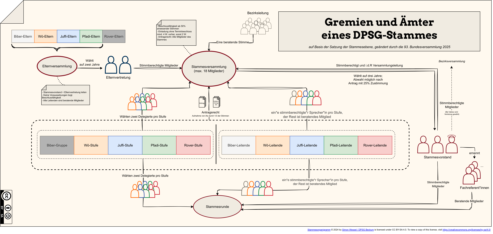

# Ein DPSG-Stamm als Organigramm
[![CC BY-SA 4.0][cc-by-sa-shield]][cc-by-sa]

Pfadfinderstämme in der Deutschen Pfadfinderschaft St. Georg sind nach der [Satzung der Stammesebene](https://dpsg.de/de/die-dpsg/ordnung-satzungen-interventionsordnung) aufgebaut. Dieses Organigramm soll einen Überblick über die verschiedenen Gremien, Ämter und Aufgaben geben:

[cc-by-sa-shield]: https://img.shields.io/badge/License-CC%20BY--SA%204.0-lightgrey.svg

## Diagramm exportieren

### Voraussetzungen:
+ Draw.io ist installiert und das CLI erreichbar
  
### Export als PDF- und PNG-Datei
Durch den Befehl `make export` wird das Organigramm exportiert. Dabei wir eine PDF- und eine PNG-Datei erstellt. Um nur eines der beiden Formate zu erhalten, kann `make export_pdf` bzw. `make export_png` ausgeführt werden.

## Lizenz

This work is licensed under a
[Creative Commons Attribution-ShareAlike 4.0 International License][cc-by-sa].

[![CC BY-SA 4.0][cc-by-sa-image]][cc-by-sa]

[cc-by-sa]: http://creativecommons.org/licenses/by-sa/4.0/
[cc-by-sa-image]: https://licensebuttons.net/l/by-sa/4.0/88x31.png

## Authors

- [@swssl](https://www.github.com/swssl)

